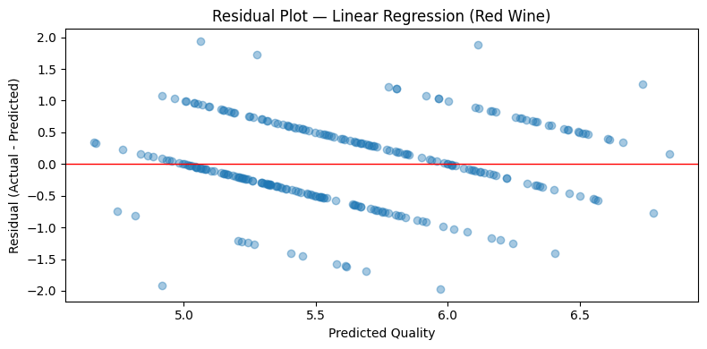
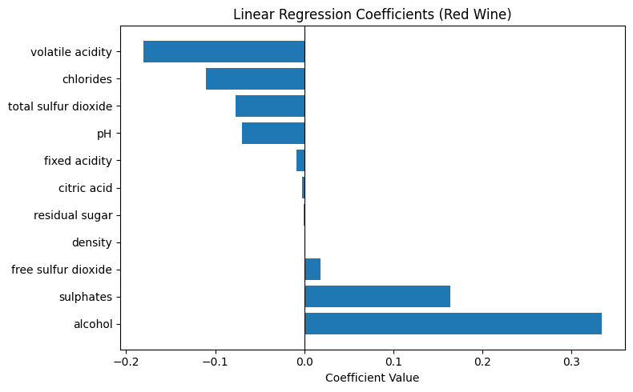

# Wine Quality Regression

Five-person CSCI 323 group project at UOW (SIM Singapore). The team compared classification and regression models on the UCI red and white wine datasets. My modelling contribution was **Linear Regression**, including its pipeline, small parameter search and performance report.

## Tech stack

   

**My implementation:** the scikit-learn Linear Regression pipeline, parameter search and evaluation. Ensemble and classification models were implemented by teammates.

## My contribution

| Deliverable | Scope |
|---|---|
| Code | Linear Regression in both notebooks; other members implemented Random Forest, Gradient Boosting and classification |
| Report | Standardisation part of §2.2, the regression model descriptions in §2.3, and regression setup/tuning in §3.2 |
| Presentation | Section 3: regression models and their setup |

The regression comparison presentation was another member's section. The team's contribution tables are in [the report](docs/CSCI323_FT14_Report.pdf) and [presentation](docs/CSCI323_FT14_Presentation.pdf). [Recorded presentation](https://youtu.be/-RX6cVTDkVg).

## Data and method

The [UCI Wine Quality data](https://archive.ics.uci.edu/dataset/186/wine+quality) contain 11 physicochemical measurements and an integer quality score. Red and white wine are analysed separately. Removing exact duplicate rows reduces red from 1,599 to 1,359 observations and white from 4,898 to 3,961, before an 80/20 split. This avoids identical rows crossing the split, but changes the evaluation population from the raw dataset.

Linear Regression uses `StandardScaler` inside a pipeline and five-fold cross-validation over `fit_intercept=True/False`. This is a narrow baseline search. Scaling expresses coefficients per training-set standard deviation; unregularised OLS predictions do not generally require it. Keeping preprocessing inside the pipeline also makes its fit scope explicit.

## Recorded regression results

These are the team's saved notebook results; ensemble code and results are credited to the other members.

| Dataset | Model | Train RMSE | Test RMSE | Test R² |
|---|---|---:|---:|---:|
| Red | Linear Regression | 0.6560 | 0.6629 | 0.3294 |
| Red | Random Forest | 0.4468 | 0.6451 | 0.3649 |
| Red | Gradient Boosting | 0.5388 | 0.6441 | 0.3670 |
| White | Linear Regression | 0.7443 | 0.7505 | 0.2947 |
| White | Random Forest | 0.2564 | 0.7013 | 0.3841 |
| White | Gradient Boosting | 0.5705 | 0.7109 | 0.3672 |

OLS provides a useful reference, but it can overfit and its small train–test gap does not measure the noise floor. Random Forest reduces white-wine test RMSE by about 6.6% versus OLS despite a larger training gap. For red wine, the 0.0010 RMSE difference between the two ensembles is too small to treat as a reliable ranking from one split.



A wide residual scatter alone does not establish underfitting or nonlinearity. Systematic residual patterns, repeated validation and model comparisons would be needed for a stronger diagnosis.



Each coefficient describes a one-training-standard-deviation change, holding other model inputs fixed. Correlated features complicate interpretation, and these associations are not causal. Tree impurity importance has no positive/negative direction.

## Run and provenance

```bash
pip install -r requirements.txt
jupyter notebook WineQuality_RED.ipynb
```

Run from the repository root; both notebooks read the included `wine+quality/` CSVs. The missing ZIP extraction step has been removed. Notebook prose and this README were corrected during portfolio maintenance; the PDFs retain the submitted team report and presentation. Read the corrected interpretation here alongside those historical documents.

Limitations include a single holdout, full-dataset exploratory plots before splitting, subjective ordinal ratings modelled as continuous, and wine from a limited source. Similar scores do not prove an information ceiling in the 11 features. The original contribution split still applies to the corrected notebooks.
